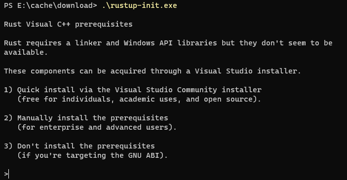
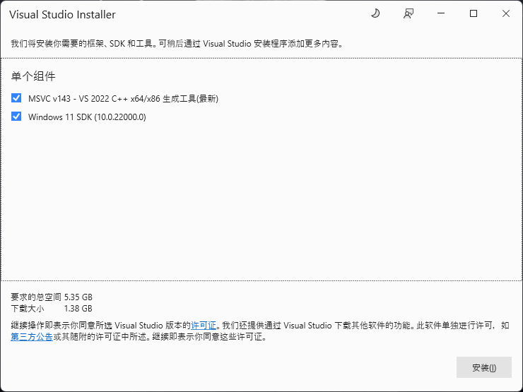
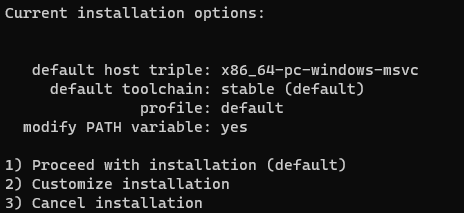

# tauri-app-demo

基于tauri-app创建的桌面客户端程序

本地环境

node 版本 v18.18.0

npm 版本 v9.8.1


## 安装rust环境


### Rust的下载

在官网下载Rust安装文件，rust官网[下载地址](https://www.rust-lang.org/tools/install)，得到一个可执行文件 rustup-init.exe。

Rust 的编译工具依赖 C 语言的编译工具，这意味着你的电脑上至少已经存在一个 C 语言的编译环境。如果你使用的是 Linux 系统，往往已经具备了 GCC 或 clang。如果你使用的是 macOS，需要安装 Xcode。如果你是用的是 Windows 操作系统，你需要安装 Visual Studio 2013 或以上的环境）。

### Rust的安装

在C语言编译工具下载配置好后，就可以开始安装了。如果直接运行 rustup-init.exe 的话下载速度很慢，因此进行如下操作。

打开powershell，进入到rustup-init.ext所在的目录，依次输入如下命令：

```shell
$ENV:RUSTUP_DIST_SERVER='https://mirrors.ustc.edu.cn/rust-static'
$ENV:RUSTUP_UPDATE_ROOT='https://mirrors.ustc.edu.cn/rust-static/rustup'
rustup-init.exe
```


### 检验安装


安装成功后，命令行验证如下

```
rustc --version
```


### 附录-安装参考资料


[windows安装配置rust](https://cloud.tencent.com/developer/article/2379305)

进入终端安装



进入确认安装界面



`windows 10 msc v143`
`windows 10 sdk`

- 选择 msvc 单个组件
- 选择 c++ 生成工具的



默认第一个安装


### 常见问题


1. 网络问题

途中可能会遇到网络问题，耐心等待

2. Visual Studio Code 安装失败

默认提示安装 2022 版本，安装过程中，提示版本跟本地操作系统不相符，需要选择合适的版本安装

官方网站下载合适的版本（本地系统适配安装 2019 版本）

https://learn.microsoft.com/zh-cn/visualstudio/releases/2019/release-notes


## 初始化 tauri-app


```
npm create tauri-app@latest
npm install
npm run tauri dev
```


### 启动报错


需要，额外安装 webview2

```
error while running tauri application: Runtime(
    CreateWebview(
        WebView2Error(
            WindowsError(Error { code: 0x80070002, message: 系统找不到指定的文件。 })
        )
    )
)
```


### 安装 webview2


安装后运行

https://developer.microsoft.com/en-us/microsoft-edge/webview2

安装后再次运行

```
npm run tauri dev
```
